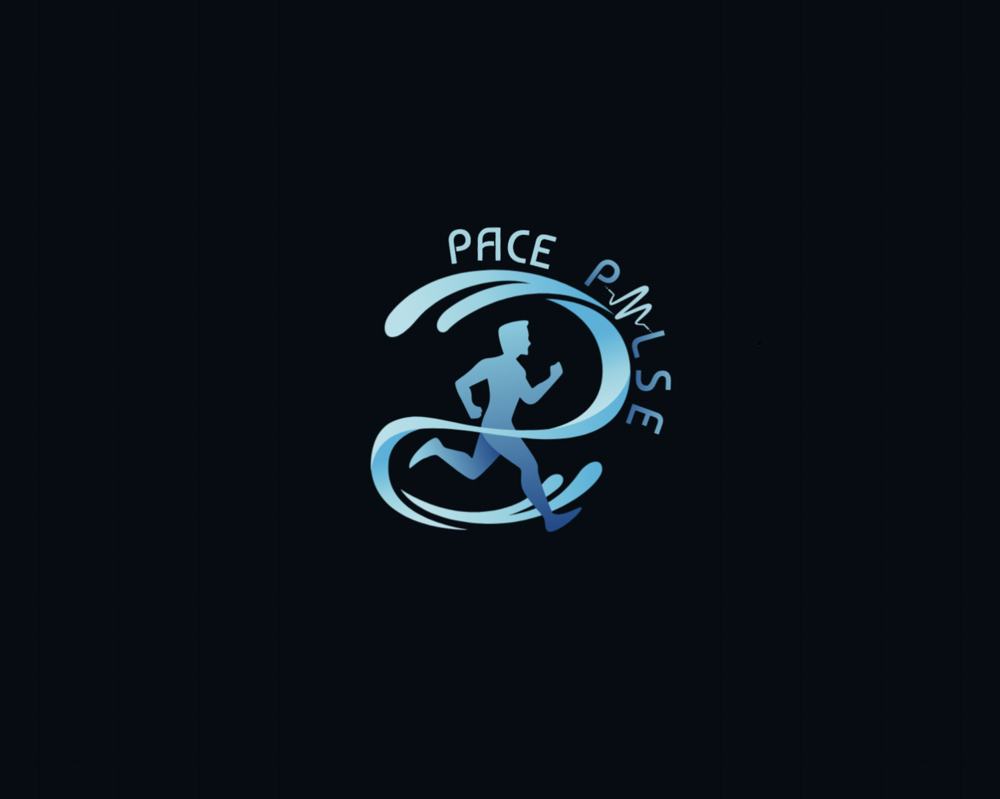

# PacePulse 

school-portfolio

PacePulse Logo
The logo was designed for PacePulse, a pace-tracking app built as part of a Human-Computer Interaction (HCI) project. The concept centers around a runner’s intuitive connection with their pace — not just numbers on a screen, but a rhythm you feel.
At the heart of the design is a runner encircled by smooth, wave-like swooshes, evoking the sensation of being in sync, like flowing water on a perfect run. It’s a visual metaphor for balance, discipline, and motion.
The logo subtly applies Gestalt principles:
Closure completes the circular motion around the runner,
Continuation leads the eye in a smooth, uninterrupted path,
Proximity groups the pulse line and “PLSE” text to suggest a complete word "PULSE",
Common Fate unites all elements in a shared direction, forward.
The entire piece reflects what PacePulse stands for: not just keeping pace, but feeling it, knowing when you're too fast, too slow, or just right. A good run is more than physical. This logo captures that flow.
